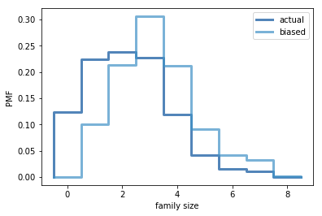

[Think Stats Chapter 3 Exercise 1](http://greenteapress.com/thinkstats2/html/thinkstats2004.html#toc31) (actual vs. biased)

>> The actual pmf mean is `2.2` and the biased pmf mean is `3.2`. This shows that the pmf is skewed towards the families with larger numbers of children.
Code:
```python
%matplotlib inline

import numpy as np

import nsfg
import first
import thinkstats2
import thinkplot

resp = nsfg.ReadFemResp()

def BiasPmf(pmf, label):
    new_pmf = pmf.Copy(label=label)

    for x, p in pmf.Items():
        new_pmf.Mult(x, x)
        
    new_pmf.Normalize()
    return new_pmf
    
pmf = thinkstats2.Pmf(resp.numfmhh,label='actual')
biased_pmf = BiasPmf(pmf, label='biased')

thinkplot.PrePlot(2)
thinkplot.Pmfs([pmf, biased_pmf])
thinkplot.Config(xlabel='family size', ylabel='PMF')
```
