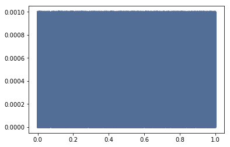
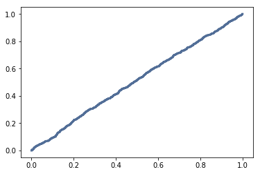

[Think Stats Chapter 4 Exercise 2](http://greenteapress.com/thinkstats2/html/thinkstats2005.html#toc41) (a random distribution)

>> This does appear to be a uniform distribution according to the visualizations. CDF is a straight line since it is cumulative and PMF is a block since all values have the same probability or appearing.
```python
random_nums = np.random.random(1000)

pmf = thinkstats2.Pmf(random_nums)
thinkplot.Pmf(pmf)
```


```python
cdf = thinkstats2.Cdf(random_nums)
thinkplot.Cdf(cdf)
```

